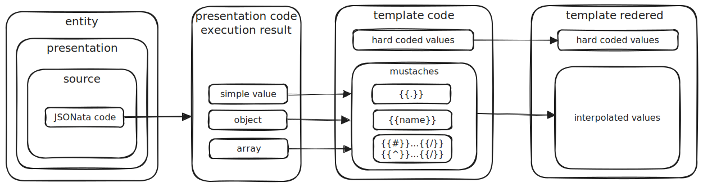

# mustache-dh-tutorial
Практические уроки по использованию mustaches в шаблонах DocHub

###### Ссылки:
* официальная документация [mustache](https://mustache.github.io/mustache.5.html)
* основной портал по [DocHub](https://dochub.info)

###### Предварительные условия:
* установлен плагин DocHub для vsCode или Idea
* данный репозиторий склонирован на локальный диск
* у вас есть базовое понимание об устройстве DocHub entities

###### Инструкции:
1. Откройте плагин DocHub в локальной папке, в которой расположен данный репозиторий -- если вы увидели данный документ в плагине, значит все идет хорошо
1. Перейдите в основное меню плагина: Документы>Mustache Tutorial и пройдите последовательно все уроки

###### Что не вошло в данный тьюториал
* {{{...}}} (triple mustache), {{&...}} -- интерполирует значения без учета экранирования (unescaped) специальных символов. Задания по этой фиче будут добавлены в следующих версиях тьюториала.
* Lambdas, Partials, Blocks, Delimeters -- нет уверенности, что это применимо в DH, поэтому, если у вас есть пример использования этих фичей, то оформите, пожалуйста, Issue (подробный Feature Request)
